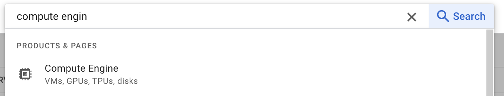
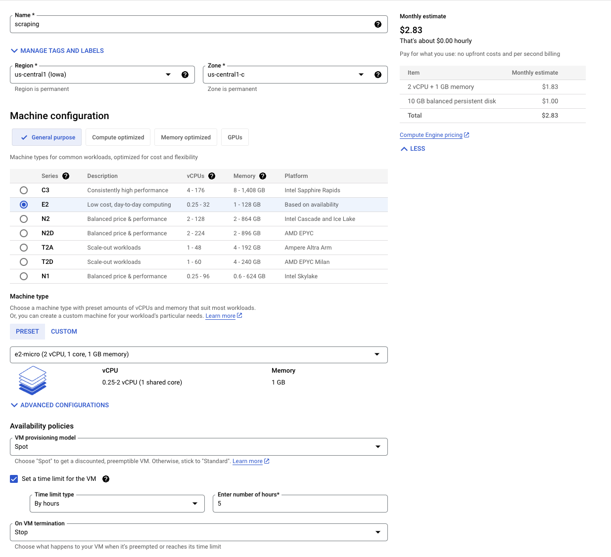
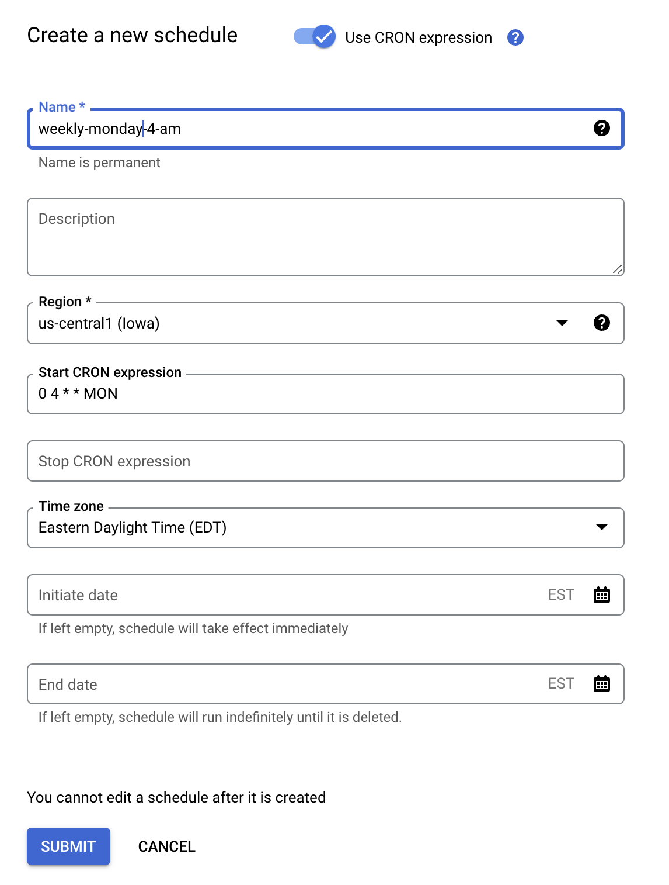
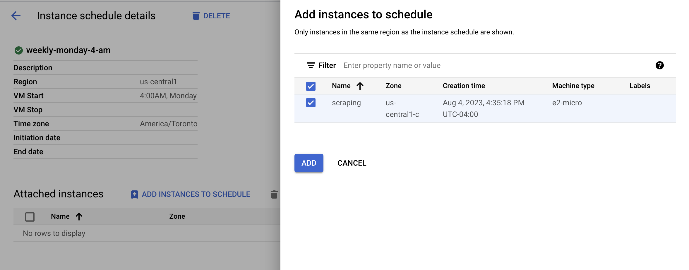
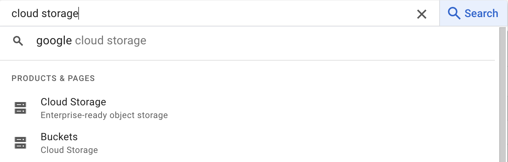

I still remember the day when one of my college professors introduced me to crontab, a way to schedule tasks on my computer. It was pretty cool! I liked it so much that I started scheduling random messages with a robotic voice, even though it sometimes startled me when it started talking while I was deep in thought. But that's a funny story for another time.

Now, fast forward to today, and the need for scheduled tasks is still around. In this blog, I'll show you how to make your spiders (those cool web data collectors) run on a schedule within a Virtual Machine (VM). Think of it like a digital alarm clock for your data tasks. The system I'll explain doesn't even need a database. It's all about grabbing online data for fun analysis without storing the data in a database. As for the cost, I don't have an exact number yet, but based on my recent move of shifting all my spiders from local machines to this setup, I'm pretty confident it'll stay under $10.

# Computer Engine

First go to **Computer Engine**



Create your instance as follow



I called this instance **scraping**

After that Create a Schedule for your instance


For example, a weekly on monday at 4 am



Then you need to link your new rule with the VM you want to apply



First part done with success.

# Cloud Storage

Go to **Buckets**



Create a bucket and done, you are good to go.

# Scrapy

Now the final piece and the most important one, you can clone [this repository](https://github.com/Andryas/example-gcp-scrapy/tree/main) if you wish. 

In this repository you need to create a file .env and set two variables

```r
BUCKET=name-of-your-bucket
GOOGLE_APPLICATION_CREDENTIALS=you-project.json
```

Ill just highlight only part of the code.

## Pipeline.py

As you see in the code below there is a variable BUCKET which I said before to define in your .env as the name of your bucket, it’s saying where it will write the information after the spider run.

```jsx
import json
from itemadapter import ItemAdapter
from src.utils.gcp import *
from src.utils.destymd import destymd
from src.settings import *

class JsonWriterPipeline:

    def __init__(self):
        pass

    def open_spider(self, spider):
        self.file = open(spider.name + ".jsonl", "w")

    def close_spider(self, spider):
        self.file.close()
        upload_blob(
            BUCKET, 
            spider.name + ".jsonl",
            destymd(spider.name, "jsonl")
        )

    def process_item(self, item, spider):
        line = json.dumps(ItemAdapter(item).asdict()) + "\n"
        self.file.write(line)
        return item
```

# Setting the VM

The last step, putting all together.

Basically you need to connect to your vm, send the file to there, setting the environment and schedule the crontab for your schedule that you did previously adding 15 minutes, which is the gap to the machine starts with security. 

Code sequence it will be this:

1. start the machine → `gcloud compute instances start scraping`
2. open the `connect.sh` file and change the information there for yours, like project and the machine name, after `bash connect.sh` and `pwd`. Get this path and change it in `deploy.sh` after the scraping: 
3. in the `deploy.sh` change `scraping:${/home/wavrzenczak/scraping}` for the path in your VM then `bash deploy.sh`
4. If everything works just fine you will have the repository in your VM where you just need to connect again and execute the `sudo bash setup.sh` which will install python and dependencies of the project.

For last, as I defined to run weekly 4 am on Mondays, my crontab it will be like this. Note the plus 15 minutes.

```sh
15 4 * * MON bash /home/wavrzenczak/scraping/crawl.sh test
```

Now, just wait for the next week and check your bucket the data it will be written in `BUCKET/test/year/month/day.json` 


Hasta la vista.

